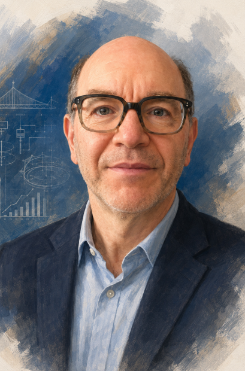

::: {.columns}

::: {.column width="35%"}

{fig-alt="Portrait photograph" width="100%"}

:::

::: {.column width="65%"}

## About Me

I am a wastewater engineering specialist, statistician, and educator with expertise in environmental data analytics, technology assessment, and evidence-based decision-making.

:::

:::

# Vince Pileggi, Ph.D., P.Eng.

## Professional Profile

I am an environmental engineer with over three decades of experience in wastewater engineering, environmental monitoring, applied statistics, and technical assessment.

My interests include integrating engineering judgment with statistical analysis to support transparent, evidence-based decision making. I am particularly interested in developing reproducible analytical workflows that improve technical communication and facilitate knowledge sharing across the engineering profession.

## Credentials

- Ph.D.
- Professional Engineer (P.Eng.)
- Adjunct Professor, University of Guelph
- Environmental Engineering
- Applied Statistics
- Technical Writing
- Reproducible Research

## Areas of Expertise

::: {.grid}

::: {.g-col-6}
### Environmental Engineering

Wastewater treatment, monitoring data, treatment system performance, and engineering interpretation.
:::

::: {.g-col-6}
### Applied Statistics

Descriptive statistics, uncertainty, reliability, visualization, and practical statistical communication.
:::

::: {.g-col-6}
### Reproducible Reporting

Quarto, R, Python, Git, GitHub, and transparent technical workflows.
:::

::: {.g-col-6}
### Teaching and Mentoring

Engineering education, professional development, plain-language technical writing, and student support.
:::

:::

## Current Interests

Current areas of interest include:

- Evidence-based environmental engineering
- Treatment performance assessment
- Applied statistics for engineering
- Reproducible reporting using Quarto
- Python and R for environmental data analysis
- Engineering education and mentoring
- Technical communication in plain language

## Professional Philosophy

Engineering decisions should be based on clear objectives, reliable data, appropriate analysis, transparent assumptions, and plain-language communication.

Good technical work should not only produce answers; it should also explain how those answers were developed, what uncertainty remains, and how the results should be interpreted.

## Guiding Principles

- Teach methods, not projects.
- Use evidence before opinion.
- Communicate uncertainty clearly.
- Prefer reproducible workflows.
- Keep public examples generalized, synthetic, or based on public information.
- Avoid disclosing confidential, proprietary, or project-specific information.

## Educational and Professional Resource

This website is intended for educational and professional development purposes. It presents generalized engineering methods, statistical techniques, and reproducible workflows. Any examples are illustrative and do not represent specific facilities, organizations, clients, suppliers, manufacturers, technology proponents, or regulatory assessments.

## Contact

For now, please use the GitHub link in the navigation bar.

---

> *The objective of this website is to advance environmental engineering through the sharing of public knowledge, evidence-based methods, and reproducible analytical workflows.*

